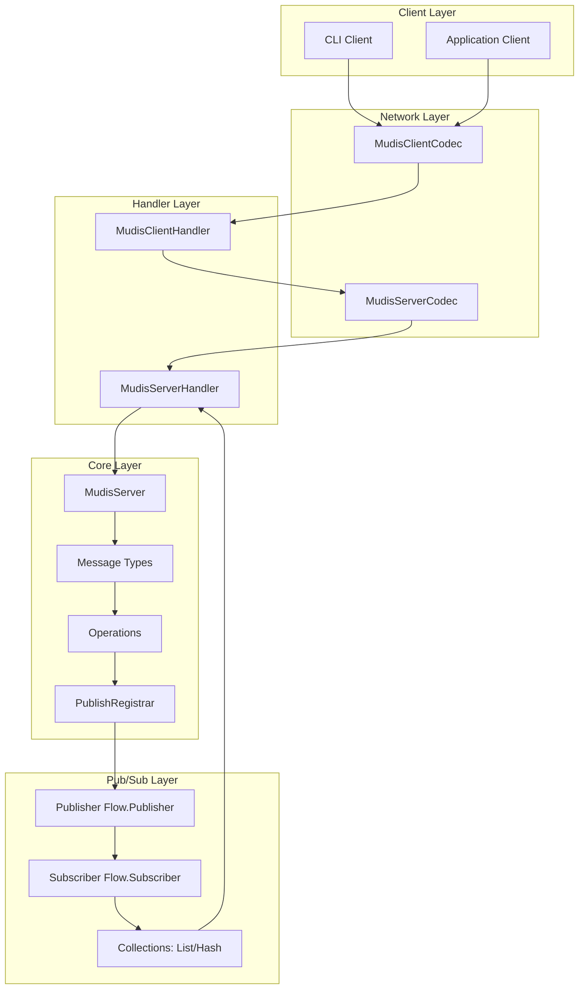
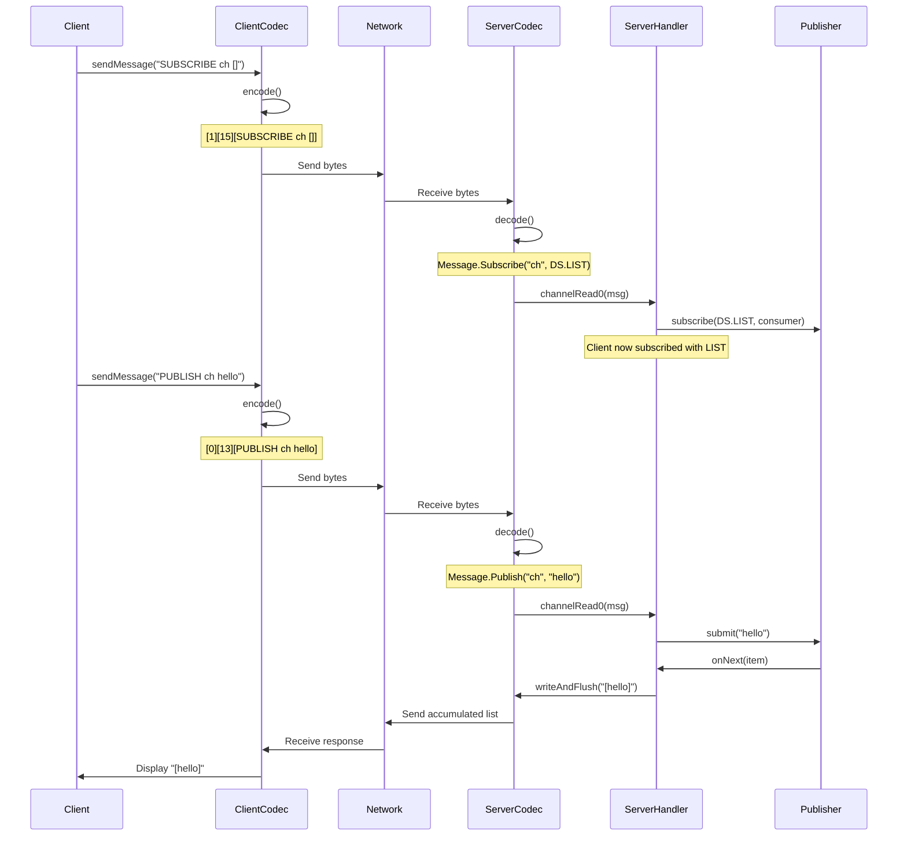
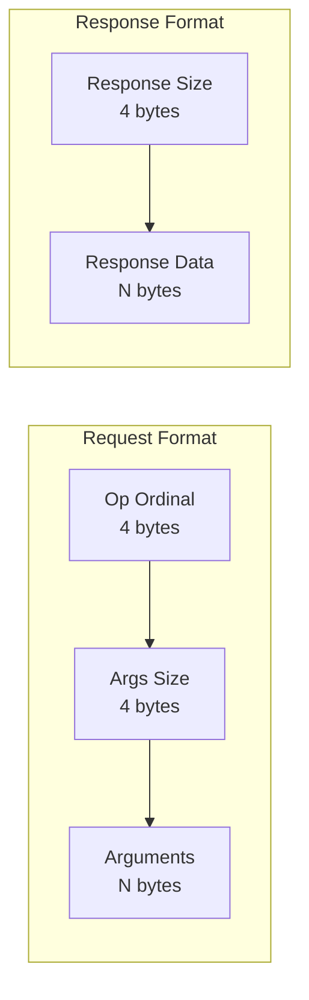

# Mudis

Performant key-value store with pub/sub capabilities built on Netty and Spring.

## Architecture Overview

### System Architecture



### Communication Flow



### Protocol Format



## Features

- **Custom Binary Protocol**: Efficient binary protocol with operation codes and length-prefixed arguments
- **Reactive Pub/Sub**: Publish/subscribe messaging using Java Flow API with backpressure support
- **Data Structure Accumulation**: Optional message accumulation in Lists or Hash Sets per subscriber
- **High Performance**: Built on Netty with optimized channel options
- **Spring Integration**: Managed lifecycle with Spring Boot
- **Scalable**: Configurable thread pools for boss and worker groups

## Supported Operations

### SUBSCRIBE

Subscribe to a channel to receive published messages with optional data structure accumulation.

**Format**: `SUBSCRIBE <channel> [data_structure]`

**Data Structures**:

- `[]` - Accumulate messages in a list (append each message)
- `#{}` - Accumulate messages in a hash set (unique messages only)
- (empty) - Just receive messages without accumulation

**Examples**:

```
SUBSCRIBE news           # Just receive messages
SUBSCRIBE logs []        # Accumulate in list
SUBSCRIBE metrics #{}    # Accumulate unique messages in hash
```

**Behavior**:

- **Without DS**: Receives each message individually as published
- **With LIST**: Receives the entire list after each new message: `[msg1, msg2, msg3]`
- **With HASH**: Receives the entire set after each new message: `[msg1, msg2]` (duplicates removed)

### PUBLISH

Publish a message to a channel. All subscribers receive the message according to their data structure preference.

**Format**: `PUBLISH <channel> <message>`

**Examples**:

```
PUBLISH news "Breaking news"
PUBLISH logs "Error occurred"
PUBLISH metrics "cpu:95"
```

**Behavior**:

- Message is sent to all subscribers of the channel
- Subscribers with `[]` (LIST) will accumulate messages in order
- Subscribers with `#{}` (HASH) will accumulate unique messages only
- Subscribers without DS will receive each message individually

**Response**: Message delivery depends on subscriber's data structure setting

## Project Structure

```
mudis/
├── src/main/java/io/mudis/mudis/
│   ├── MudisApplication.java          # Spring Boot application entry point
│   ├── client/
│   │   ├── Client.java                # Client interface
│   │   ├── MudisClient.java           # Netty-based client implementation
│   │   └── MudisClientHandler.java    # Client message handler
│   ├── server/
│   │   ├── Server.java                # Server interface
│   │   ├── MudisServer.java           # Netty-based server implementation
│   │   ├── MudisServerHandler.java    # Server message handler
│   │   └── config/
│   │       └── ServerConfig.java      # Spring configuration
│   ├── codec/
│   │   ├── MudisClientCodec.java      # Client protocol codec
│   │   └── MudisServerCodec.java      # Server protocol codec
│   ├── model/
│   │   ├── Message.java               # Message types (Subscribe, Publish)
│   │   ├── Op.java                    # Operation enum
│   │   └── Ds.java                    # Data structure enum
│   ├── pubsub/
│   │   ├── Publisher.java             # Flow.Publisher implementation
│   │   └── PublishRegistrar.java      # Channel-to-Publisher registry
│   └── shell/
│       ├── KVCommands.java            # Key-value shell commands
│       └── PubSubCommands.java        # Pub/sub shell commands
└── src/main/resources/
    └── application.yml                # Configuration
```

## Configuration

### application.yml

```yaml
spring:
  application:
    name: mudis

mudis:
  server:
    port: 8888
    host: localhost
```

### Channel Options

**Server Options**:

- `SO_BACKLOG: 1024` - Maximum pending connections
- `SO_REUSEADDR: true` - Allow address reuse
- `TCP_NODELAY: true` - Disable Nagle's algorithm for low latency
- `SO_KEEPALIVE: true` - Detect dead connections

**Client Options**:

- `TCP_NODELAY: true` - Low latency
- `SO_KEEPALIVE: true` - Connection health
- `CONNECT_TIMEOUT_MILLIS: 5000` - Connection timeout

## Thread Pools

- **Boss Group**: 4 threads (accepts connections)
- **Worker Group**: 2 threads (handles I/O)
- **Client Worker Group**: 1 thread per client

## Getting Started

### Running the Server

```bash
mvn spring-boot:run
```

### Using the Client

```java

@Autowired
private ApplicationContext context;

public void example() {
    // Get a new client instance (prototype scope)
    MudisClient client = context.getBean(MudisClient.class);

    // Connect to server
    client.connect();

    // Subscribe without data structure (receive messages individually)
    client.sendMessage("SUBSCRIBE news");

    // Subscribe with LIST (accumulate all messages)
    client.sendMessage("SUBSCRIBE logs []");

    // Subscribe with HASH (accumulate unique messages)
    client.sendMessage("SUBSCRIBE metrics #{}");

    // Publish messages
    client.sendMessage("PUBLISH news Hello");
    client.sendMessage("PUBLISH logs Error1");
    client.sendMessage("PUBLISH logs Error2");
    // Client subscribed to logs will receive: "[Error1, Error2]"

    client.sendMessage("PUBLISH metrics cpu:80");
    client.sendMessage("PUBLISH metrics cpu:80");
    // Client subscribed to metrics will receive: "[cpu:80]" (duplicate ignored)

    // Disconnect
    client.disconnect();
}
```

### Command Line Interface

The application includes a Spring Shell interface for interactive testing:

```bash
# Start the application
mvn spring-boot:run

# In the shell - Subscribe without accumulation
mudis> subscribe news
# Receives each message individually

# Subscribe with LIST accumulation
mudis> subscribe logs []
# Receives: "[msg1]", then "[msg1, msg2]", then "[msg1, msg2, msg3]", etc.

# Subscribe with HASH accumulation
mudis> subscribe metrics #{}
# Receives: "[msg1]", then "[msg1, msg2]", etc. (duplicates removed)

# Publish messages
mudis> publish news "Breaking News"
mudis> publish logs "Error occurred"
mudis> publish metrics "cpu:95"
```

## Protocol Details

### Message Encoding (Client → Server)

1. **Operation Ordinal** (4 bytes): Integer representing the operation
    - 0 = PUBLISH
    - 1 = SUBSCRIBE

2. **Arguments Size** (4 bytes): Length of arguments in bytes

3. **Arguments** (N bytes): Space-delimited UTF-8 string
    - SUBSCRIBE: `<channel> [ds]` where ds is `[]` or `#{}`
    - PUBLISH: `<channel> <message>`

### Response Encoding (Server → Client)

1. **Response Size** (4 bytes): Length of response string

2. **Response Data** (N bytes): UTF-8 string
    - Without DS: Individual message (e.g., `"hello"`)
    - With LIST: Accumulated list as string (e.g., `"[msg1, msg2, msg3]"`)
    - With HASH: Accumulated set as string (e.g., `"[msg1, msg2]"`)

### Data Structure Behavior

**LIST (`[]`)**:

- Accumulates messages in insertion order
- Backed by `ArrayList`
- Each publish appends to the list
- Subscriber receives entire list after each message

**HASH (`#{}`)**:

- Accumulates unique messages only
- Backed by `LinkedHashSet`
- Duplicates are ignored
- Subscriber receives entire set after each message

**NONE (default)**:

- No accumulation
- Subscriber receives each message individually
- Lowest memory footprint