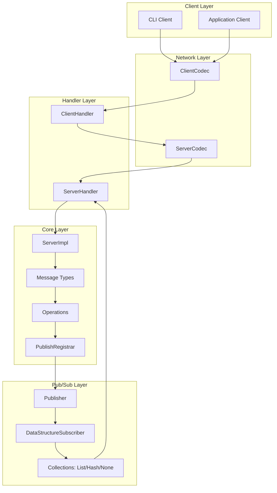
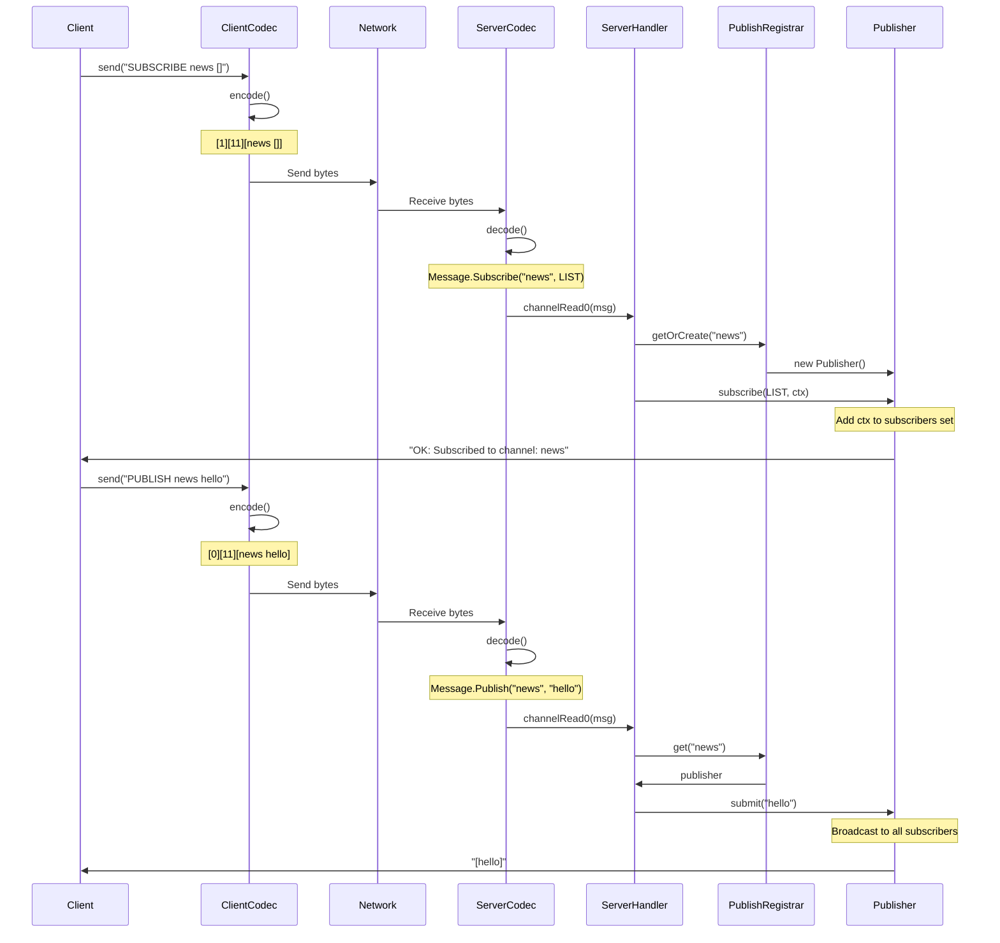
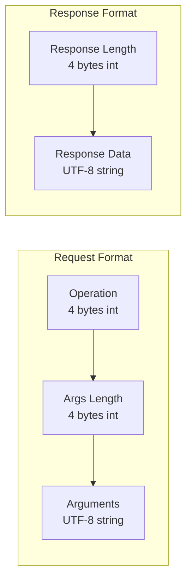

# Mudis

High-performance pub/sub messaging system built on Netty and Spring Boot with reactive streams support.

## Architecture Overview

### System Architecture



### Communication Flow



### Protocol Format



## Features

- **Custom Binary Protocol**: Efficient length-prefixed binary protocol with operation codes
- **Reactive Pub/Sub**: Built on Java Flow API (SubmissionPublisher) with backpressure support
- **Data Structure Accumulation**: Optional message accumulation in Lists or Sets per subscriber
- **High Performance**: Built on Netty with optimized channel options and thread pools
- **Thread-Safe**: Concurrent collections and proper synchronization throughout
- **Spring Integration**: Full lifecycle management with Spring Boot and dependency injection
- **Connection Resilience**: Automatic retry logic with exponential backoff
- **Clean Architecture**: Dependency injection, proper encapsulation, and separation of concerns

## Core Concepts

### Publisher Ownership Model

Each `Publisher` instance directly owns its subscribers:

```java
public class Publisher extends SubmissionPublisher<String> {
    // Each publisher owns its subscriber contexts
    private final Set<ChannelHandlerContext> subscribers;
    private final Map<ChannelHandlerContext, DataStructureSubscriber> subscriberMap;
}
```

**Benefits**:
- Direct ownership - no external registrar needed
- Better encapsulation - subscribers are private
- Simpler design - follows Information Expert principle
- More efficient - direct access instead of map lookups

### Data Structures

Subscribers can choose how to receive messages:

- **NONE** (default): Receive each message individually as published
- **LIST** (`[]`): Accumulate messages in order, receive entire list after each publish
- **HASH** (`#{}`): Accumulate unique messages, receive entire set after each publish

## Supported Operations

### SUBSCRIBE

Subscribe to a channel with optional data structure accumulation.

**Format**: `SUBSCRIBE <channel> [data_structure]`

**Data Structures**:
- `[]` - Accumulate messages in a List (preserves order, allows duplicates)
- `#{}` - Accumulate messages in a Set (unique messages only)
- (empty) - No accumulation, receive each message individually

**Examples**:
```
SUBSCRIBE news           # Receive each message: "hello", "world"
SUBSCRIBE logs []        # Receive accumulated list: "[hello]", "[hello, world]"
SUBSCRIBE metrics #{}    # Receive unique set: "[hello]", "[hello, world]"
```

**Behavior**:
- Creates publisher for channel if it doesn't exist
- Adds subscriber context to publisher's subscriber set
- Returns confirmation: `OK: Subscribed to channel: <channel>`

### PUBLISH

Publish a message to all subscribers of a channel.

**Format**: `PUBLISH <channel> <message>`

**Examples**:
```
PUBLISH news "Breaking news story"
PUBLISH logs "ERROR: Connection failed"
PUBLISH metrics "cpu:95"
```

**Behavior**:
- Finds publisher for the channel
- Submits message to all subscribers using Flow API
- Each subscriber receives based on their data structure setting
- Returns: `OK: Published to N subscriber(s)` or `WARN: No subscribers`

### UNSUBSCRIBE

Unsubscribe from a channel.

**Format**: `UNSUBSCRIBE <channel>`

**Examples**:
```
UNSUBSCRIBE news
```

**Behavior**:
- Removes subscriber from publisher's subscriber set
- Cancels the Flow subscription
- Returns: `OK: Unsubscribed from channel: <channel>`

## Project Structure

```
mudis/
├── src/main/java/io/mudis/mudis/
│   ├── CLI.java                       # Spring Boot + Shell application entry
│   ├── client/
│   │   ├── Client.java                # Client interface
│   │   ├── ClientImpl.java            # Netty client with retry logic
│   │   └── ClientHandler.java         # Client message handler
│   ├── server/
│   │   ├── Server.java                # Server interface
│   │   ├── ServerImpl.java            # Netty server implementation
│   │   └── ServerHandler.java         # Server message handler
│   ├── codec/
│   │   ├── ClientCodec.java           # Client protocol codec
│   │   └── ServerCodec.java           # Server protocol codec
│   ├── model/
│   │   ├── Message.java               # Sealed interface: Subscribe/Publish/Unsubscribe
│   │   ├── Operation.java             # Enum: SUBSCRIBE, PUBLISH, UNSUBSCRIBE
│   │   └── DataStructure.java         # Enum: NONE, LIST, HASH
│   ├── pubsub/
│   │   ├── Publisher.java             # Flow.Publisher with subscriber ownership
│   │   └── PublishRegistrar.java      # Channel → Publisher registry
│   ├── mq/
│   │   └── MessageQueue.java          # Client-side message queue
│   ├── utils/
│   │   └── RequestValidator.java      # Protocol validation
│   └── shell/
│       ├── ServiceCommands.java       # Start/stop/status commands
│       ├── PubSubCommands.java        # Pub/sub commands
│       └── KVCommands.java            # (Reserved for future KV operations)
└── src/main/resources/
    └── application.yml                # Configuration
```

## Configuration

### application.yml

```yaml
spring:
  application:
    name: mudis

mudis:
  server:
    port: 6379      # Server port (Redis default)
    host: 0.0.0.0   # Bind address (all interfaces)
```

### Netty Channel Options

**Server Configuration**:
```text
.option(ChannelOption.SO_BACKLOG, 1024)        // Pending connection queue
.option(ChannelOption.SO_REUSEADDR, true)      // Allow address reuse
.childOption(ChannelOption.TCP_NODELAY, true)  // Disable Nagle for low latency
.childOption(ChannelOption.SO_KEEPALIVE, true) // TCP keepalive
```

**Client Configuration**:
```text
.option(ChannelOption.TCP_NODELAY, true)              // Low latency
.option(ChannelOption.SO_KEEPALIVE, true)             // Connection health
.option(ChannelOption.CONNECT_TIMEOUT_MILLIS, 5000)   // 5s timeout
```

### Thread Pools

- **Server Boss Group**: 1 thread (accepts connections)
- **Server Worker Group**: 4 threads (handles I/O operations)
- **Client Worker Group**: 1 thread per client instance

## Getting Started

### Prerequisites

- Java 17 or higher
- Maven 3.6+

### Running the Server

```bash
# Build the project
mvn clean install

# Run the application
mvn spring-boot:run

# Or run the JAR
java -jar target/mudis-1.0.0.jar
```

### Using the CLI

The application includes an interactive Spring Shell interface:

```bash
mudis:> start
✓ Server started
✓ Client connected
Mudis service ready!

mudis:> status
=== Mudis Status ===
Server: RUNNING
Client: CONNECTED
Active Channels: 0

mudis:> SUBSCRIBE news
Subscription request sent
OK: Subscribed to channel: news

mudis:> PUBLISH news "Hello, World!"
Message sent
OK: Published to 1 subscriber(s)
Hello, World!

mudis:> SUBSCRIBE logs []
Subscription request sent
OK: Subscribed to channel: logs

mudis:> PUBLISH logs "Error 1"
Message sent
OK: Published to 1 subscriber(s)
[Error 1]

mudis:> PUBLISH logs "Error 2"
Message sent
OK: Published to 1 subscriber(s)
[Error 1, Error 2]

mudis:> channels
=== Active Channels (2) ===
• news
• logs

mudis:> cleanup
Cleaned up 0 inactive channel(s).

mudis:> stop
✓ Client disconnected
✓ Server stopped
✓ Pub/Sub system cleaned up
Mudis service stopped!
```

### Programmatic Usage

```java
@Autowired
private Client client;

public void example() {
    // Connect to server
    client.connect();

    // Subscribe without accumulation (receive each message)
    client.send("SUBSCRIBE news");

    // Subscribe with LIST accumulation
    client.send("SUBSCRIBE logs []");

    // Subscribe with HASH accumulation (unique only)
    client.send("SUBSCRIBE metrics #{}");

    // Publish messages
    client.send("PUBLISH news Breaking news");
    client.send("PUBLISH logs Error occurred");
    client.send("PUBLISH logs Error occurred");  // Duplicate
    // LIST subscriber sees: "[Error occurred, Error occurred]"
    // HASH subscriber would see: "[Error occurred]"

    // Unsubscribe
    client.send("UNSUBSCRIBE news");

    // Disconnect
    client.disconnect();
}
```

## Protocol Details

### Wire Format

All integers are big-endian (network byte order).

**Request (Client → Server)**:
```
+------------------+------------------+------------------+
| Operation (int)  | Args Length (int)| Arguments (UTF-8)|
|    4 bytes       |    4 bytes       |    N bytes       |
+------------------+------------------+------------------+
```

**Response (Server → Client)**:
```
+------------------+------------------+
| Length (int)     | Response (UTF-8) |
|    4 bytes       |    N bytes       |
+------------------+------------------+
```

### Operation Codes

- `0` - PUBLISH
- `1` - SUBSCRIBE
- `2` - UNSUBSCRIBE

### Argument Formats

**SUBSCRIBE**: `<channel> [data_structure]`
- channel: Required, max 256 bytes
- data_structure: Optional, either `[]` or `#{}`

**PUBLISH**: `<channel> <message>`
- channel: Required, max 256 bytes
- message: Required, max 1MB

**UNSUBSCRIBE**: `<channel>`
- channel: Required, max 256 bytes

### Size Limits

```text
MAX_SUBSCRIBE_ARGS = 256 bytes
MAX_UNSUBSCRIBE_ARGS = 256 bytes
MAX_PUBLISH_ARGS = 1MB (1,048,576 bytes)
```

### Connection Errors

Client automatically retries failed connections:
- Max 3 attempts
- 1 second delay between attempts
- Exponential backoff can be added

### Protocol Errors

All validation errors are caught and logged:
- Invalid operation codes
- Argument size violations
- Malformed messages

### Runtime Errors

- Channel disconnects automatically clean up subscriptions
- Publishers are removed when no subscribers remain
- Proper resource cleanup on shutdown

## Performance Characteristics

### Throughput

- Built on Netty's high-performance event loop
- Zero-copy buffer operations where possible
- Minimal object allocation in hot paths

### Latency

- `TCP_NODELAY` enabled for low latency
- Direct subscriber notification (no queue overhead)
- Efficient binary protocol

### Memory

- Concurrent collections for lock-free reads
- Subscribers cleaned up immediately on disconnect
- Publishers removed when channels are inactive

## Future Enhancements

- [ ] Key-Value store operations (GET, SET, DEL)
- [ ] Persistence layer
- [ ] Message TTL and expiration

## License

MIT License - see LICENSE file for details

## Acknowledgments

Built with:
- [Netty](https://netty.io/) - High-performance networking
- [Spring Boot](https://spring.io/projects/spring-boot) - Application framework
- [Spring Shell](https://spring.io/projects/spring-shell) - Interactive CLI