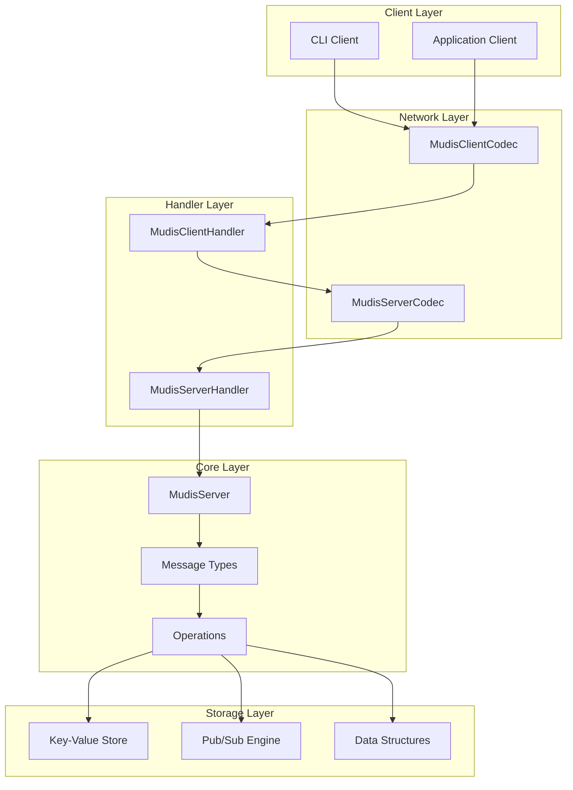
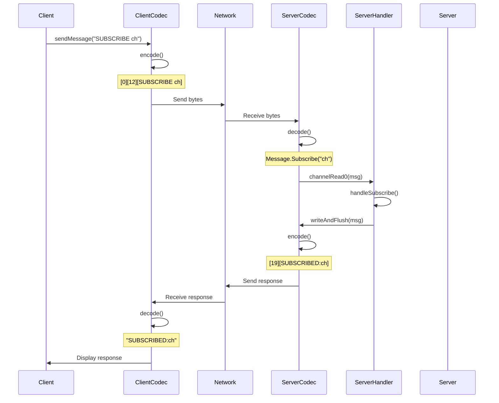
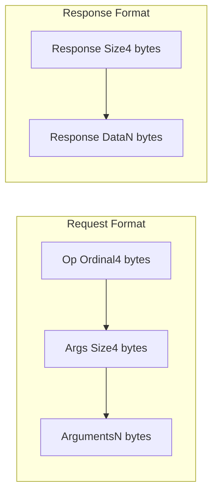

# Mudis

A high-performance, Redis-like key-value store with pub/sub capabilities built on Netty and Spring.

## Architecture Overview

### System Architecture



### Communication Flow



### Protocol Format



## Features

- **Custom Binary Protocol**: Efficient binary protocol with operation codes and length-prefixed arguments
- **Pub/Sub**: Redis-like publish/subscribe messaging
- **Data Persistence**: Optional storage in data structures (Lists, Hashes)
- **High Performance**: Built on Netty with optimized channel options
- **Spring Integration**: Managed lifecycle with Spring Boot
- **Scalable**: Configurable thread pools for boss and worker groups

## Supported Operations

### SUBSCRIBE
Subscribe to a channel to receive published messages.

**Format**: `SUBSCRIBE <channel>`

**Example**: `SUBSCRIBE news`

**Response**: `SUBSCRIBED:news`

### PUBLISH
Publish a message to a channel with optional data structure storage.

**Format**: `PUBLISH <channel> <message> [data_structure]`

**Data Structures**:
- `[]` - Append to list
- `#{}` - Store in hash
- (empty) - Just pub/sub, no persistence

**Examples**:
```
PUBLISH news "Breaking news"
PUBLISH logs "Error occurred" []
PUBLISH metrics "cpu:95" #{}
```

**Response**: `PUBLISHED:news`
