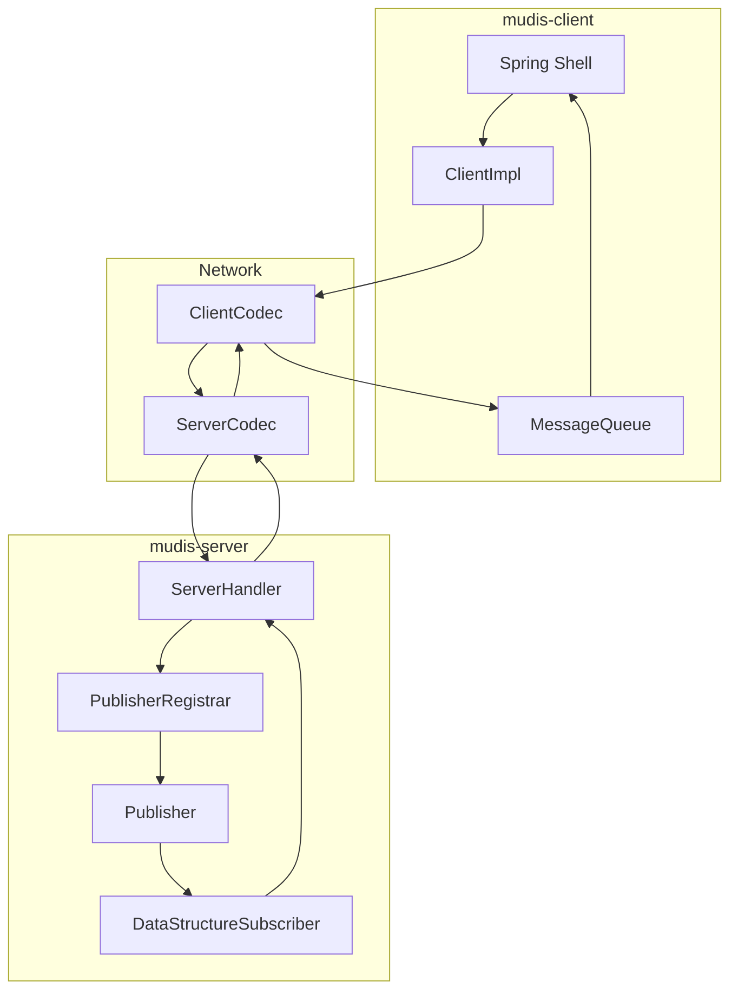
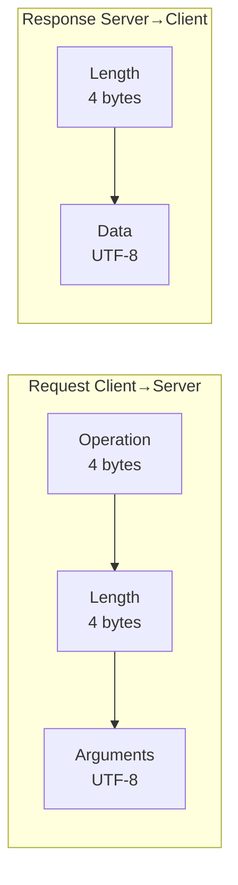
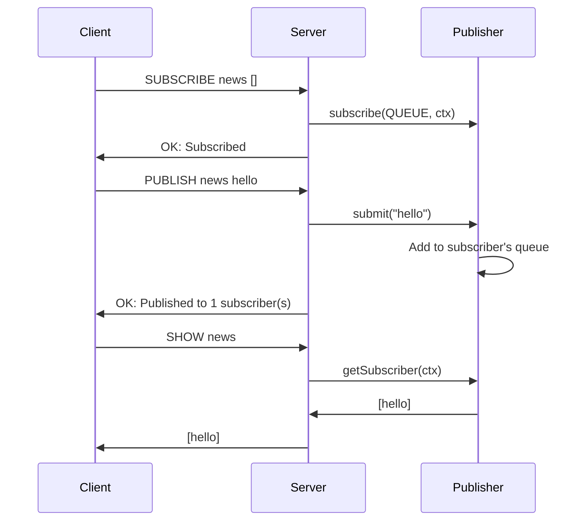

# Mudis

High-performance pub/sub messaging system built on Netty with reactive streams. Multi-module project with standalone server and Spring Boot client.

## Architecture

### Module Structure

```
mudis/
├── mudis-server/     # Standalone Netty server
├── mudis-client/     # Spring Boot client + CLI
└── pom.xml          # Parent POM
```

### System Flow



### Protocol Format



### Communication Example



## Operations

| Operation | Format | Description |
|-----------|--------|-------------|
| **SHOW** | `SHOW <channel>` | Query accumulated messages without consuming |
| **SUBSCRIBE** | `SUBSCRIBE <channel> <ds>` | Subscribe with data structure: `[]` (queue) or `#{}` (set) |
| **PUBLISH** | `PUBLISH <channel> <message>` | Publish message to channel subscribers |
| **UNSUBSCRIBE** | `UNSUBSCRIBE <channel>` | Unsubscribe from channel |

## Data Structures

- **QUEUE** (`[]`): Preserves order, allows duplicates
- **SET** (`#{}`): Unique messages only

## Quick Start

### Build

```bash
mvn clean install
```

### Run Server

```bash
cd mudis-server
mvn exec:java
```

### Run Client

```bash
cd mudis-client
mvn spring-boot:run
```

### CLI Usage

```bash
mudis-client:> start
Client connected

mudis-client:> SUBSCRIBE news []
Subscription request sent
OK: Subscribed to channel: news

mudis-client:> PUBLISH news "Hello World"
Message sent
OK: Published to 1 subscriber(s)

mudis-client:> SHOW news
[Hello World]

mudis-client:> PUBLISH news "Breaking News"
Message sent
OK: Published to 1 subscriber(s)

mudis-client:> SHOW news
[Hello World, Breaking News]

mudis-client:> UNSUBSCRIBE news
Unsubscribe request sent
OK: Unsubscribed from channel: news
```

## Configuration

**mudis-server** (`config.properties`):
```properties
mudis.server.host=0.0.0.0
mudis.server.port=6379
```

**mudis-client** (`application.yaml`):
```yaml
mudis:
  client:
    host: localhost
    port: 6379
```

## Features

- Custom binary protocol with operation codes
- Reactive pub/sub via Java Flow API
- Message accumulation in Queue or Set per subscriber
- SHOW command for non-destructive querying
- Automatic channel cleanup
- Connection retry with backoff
- Spring Shell interactive CLI
- Thread-safe concurrent operations

## License

MIT License